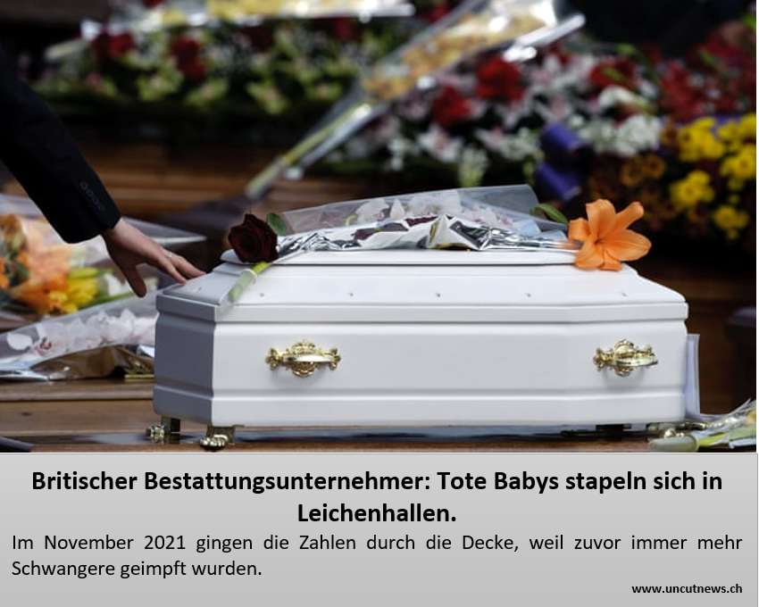
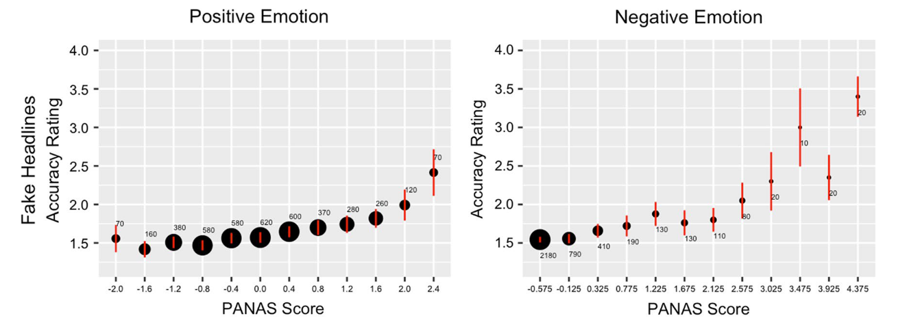
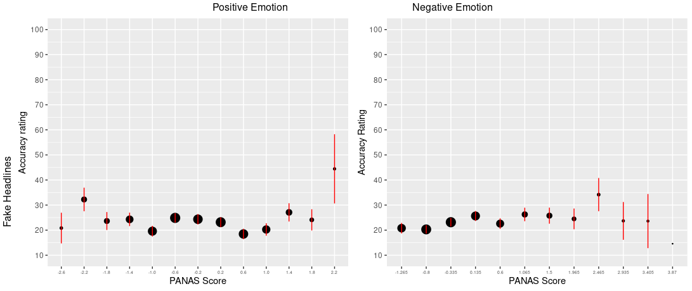
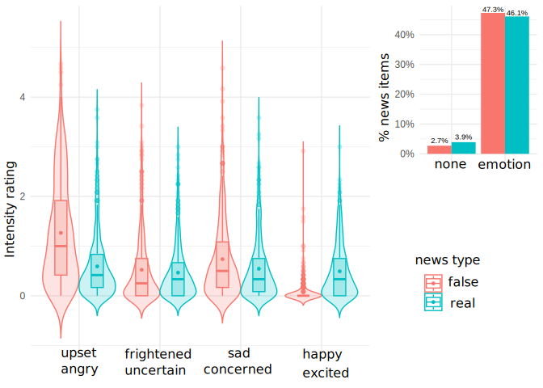
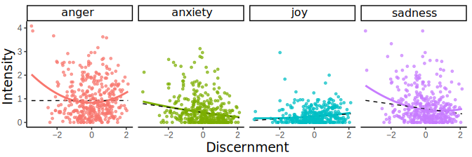
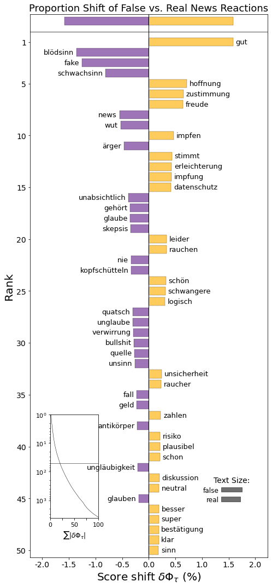
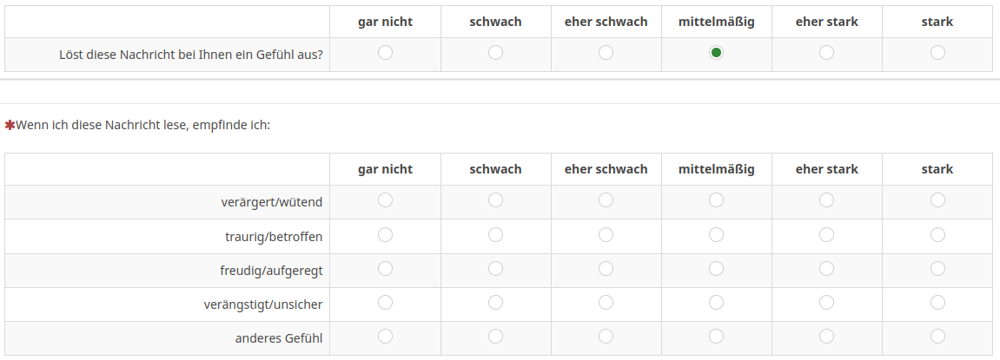

```{r xaringan-themer, include=FALSE, warning=FALSE}
# #This block contains the theme configuration for my slides style
library(xaringanthemer) #
library(showtext)
style_mono_accent(
   # base_color = "#1f5c99",
  text_font_size = "1.5rem",
  header_font_google = google_font("Josefin Sans"),
  text_font_google   = google_font("Arial", "300", "300i"),
  code_font_google   = google_font("Fira Mono")
)
```

```{r setup, include=FALSE}
options(htmltools.dir.version = FALSE)

#potential slide images
# https://pixabay.com/photos/data-computer-internet-online-www-2899901/ Image by <a href="https://pixabay.com/users/geralt-9301/?utm_source=link-attribution&amp;utm_medium=referral&amp;utm_campaign=image&amp;utm_content=2899901">Gerd Altmann</a> from <a href="https://pixabay.com//?utm_source=link-attribution&amp;utm_medium=referral&amp;utm_campaign=image&amp;utm_content=2899901">Pixabay</a>
# https://cdn.pixabay.com/photo/2017/10/29/14/47/data-2899901_960_720.jpg
#   https://pixabay.com/illustrations/corona-coronavirus-ask-5205169/ Image by <a href="https://pixabay.com/users/geralt-9301/?utm_source=link-attribution&amp;utm_medium=referral&amp;utm_campaign=image&amp;utm_content=5205169">Gerd Altmann</a> from <a href="https://pixabay.com//?utm_source=link-attribution&amp;utm_medium=referral&amp;utm_campaign=image&amp;utm_content=5205169">Pixabay</a>
```


layout: true
---
class: left, middle, title-slide
background-image: url("https://cdn.pixabay.com/photo/2017/09/10/18/25/question-2736480_960_720.jpg")
background-size: cover


# Emotions in <br> misinformation studies: 
### Distinguishing emotional state <br> from response & misinformation <br> recognition from susceptibility
### Hannah Metzler
#### Complexity Science Hub Vienna &  <br> Medical University of Vienna 
#### Workshop Järfälla, 15 Sep 2023 <br> Slides: www.hannahmetzler.eu/measuring_emo_misinfo

---
<!-- layout:true -->
<!-- <div class="my-footer"><span> -->
<!-- <a href="https://doi.org/10.1126/science.aao2998">Lazer et al. (2018) </a>  -->
<!-- </span></div> -->


<!-- --- -->

<!-- # Misinformation as umbrella term -->
<!-- ### False or misleading information -->

<!-- .pull-left[ -->
<!-- <br><br> -->
<!-- ```{r, echo=FALSE, out.width=500, fig.align='center'} -->
<!--  -->
<!-- ``` -->
<!-- ] -->
<!-- .pull-right[ -->
<!-- * Independent of intent -->

<!-- * Intentional: Disinformation <br> -->

<!-- * False News <br> -->

<!-- * Biased information <br> -->

<!-- * Conspiracies & myths -->
<!-- ] -->

---
layout: true
<div class="my-footer"><span>
<a href="https://doi.org/10.1016/j.tics.2021.02.007"> Pennycook & Rand (2021); </a>
<a href="https://doi.org/10.1186/s41235-020-00252-3"> Martel et al. (2020); </a>
<a href="https://doi.org/10.1177/0956797611413294"> Berger et al. (2011); </a>
<a href="https://doi.org/10.1027/1618-3169/a000489"> Greenstein & Franklin (2011); </a>
<a href="https://oxford.universitypressscholarship.com/view/10.1093/oso/9780190900250.001.0001/oso-9780190900250-chapter-16"> Weeks & Garrett (2019); </a> 
<a href="https://www.pexels.com/photo/annoyed-black-woman-having-video-chat-on-smartphone-at-home-5699823/"> Photo by Alex Green </a>
</span></div>

---

## Emotions & belief in misinformation - 2 theories

### 1) Emotions make us open to manipulation

.broad-left[
* Emotions attract attention

  * Trigger actions
  
  * Hinder reflection
  
  * High arousal emotions
  
* Sensational news & emotional manipulation
]

.narrow-right[
```{r, echo=FALSE, out.width=400, fig.align='right'}
knitr::include_graphics("figures/pexels-alex-green-5699823.jpg")
```
]

**Increased emotions => misinformation belief & sharing**
---
layout: true
<div class="my-footer"><span>
<a href="https://press.princeton.edu/books/hardcover/9780691178707/not-born-yesterday"> Mercier (2020); </a>
<a href="https://doi.org/10.1177/20563051221150412"> Altay et al. (2022); </a>
<a href="https://www.sciencedirect.com/science/article/pii/S2352250X22001440"> Robertson et al. (2022); </a>
<a href="https://doi.org/10.1073/pnas.2013464118"> Guess et al. (2021);</a>
<a href="https://doi.org/10.1007/978-1-4939-0867-7_10"> Steckler et al.(2014) ;</a>
<a href="https://psycnet.apa.org/doiLanding?doi=10.1037%2Fa0013503"> Nesse & Ellsworth (2009)</a>
</span></div>

---

## Emotions & belief in misinformation - 2 theories

### 2) Evolutionary theory of communication: Emotions are adaptive

.broad-left[
* Communication must benefit sender & receiver to be evolutionarily stable

* At default, people are skeptical, not gullible.

* Function of emotions depends on context:

  * Prior beliefs
  * Social motives: belonging & reputation

* Source of emotion: state vs. response
]
.narrow-right[
```{r, echo=FALSE, out.height=300}

```
]

???
- Stable: if people could be easily deceived, others would take advantage of that. 
- Pretend to be angry to get something from us. 
- If this happened often, people would realize they only pretend, they don't follow up on their threats
- so people would stop attending to the emotional signals - the signal would die out
- skeptical: hard to convince people of things they don't already believe (everyday life experience)
- Dependent on specific context
- Scientifically minded person: angry about lies being told that vaccination during pregnancy kills babies
- Vaccine skeptics angry that babies die
- Emotions as signals for social opportunities & threats
- In this view, what causes an emotion is crucial to predict it's influence

---
layout: true
<div class="my-footer"><span>
<a href="https://journals.sagepub.com/doi/pdf/10.1177/0963721417718261">  Douglas et al. (2017); </a>
<a href="https://press.princeton.edu/books/hardcover/9780691178707/not-born-yesterday"> Mercier (2020) </a>
</span></div>

---

# Example: Misinformation in crisis times

.pull-left[
**1) Uncertainty = susceptibility**

* Anxiety & loss of control

* Sense making to reduce uncertainty

* Simple cause-effect & evil-good stories
]

.pull-right[
**2) Adaptive emotions & behavior**
* Openness to potentially relevant information is adaptive

* Not all beliefs influence behavior

* Gaining status by sharing socially relevant (=surprising) news
    * Extremist: cutting bridges to prove loyalty
]

???
Cutting bridges by making extreme statements and proving loyalty to a fringe group - statements need to be crazy
Difference between reflective and intuitive beliefs: beliefs that are relevant for our actions

---
layout:true

---

## Methods overview

* Pre-registered replication of correlation study 1 from [Martel, Pennycook & Rand (2020)](https://doi.org/10.1186/s41235-020-00252-3)

* Online survey, Austria, Dec 2021, N=422, left-leaning & educated sample

* Actual false & real COVID-19 news items (n=24): accuracy rating task

<center>
```{r, echo=FALSE, out.height=270}
knitr::include_graphics("figures/N15.PNG")
```
```{r, echo=FALSE, out.height=270}
knitr::include_graphics("figures/NR14.PNG")
```
</center>

---
layout:true
<div class= "my-footer"><span>
<a href="https://doi.org/10.1186/s41235-020-00252-3"> Martel et al. (2020) </a>
</span></div>

---

## Replication: Emotion & discernment don't correlate

.pull-left[.center-left[
Martel et al. (2020)
```{r, echo=FALSE}

```

Replication
```{r, echo=FALSE, out.width=500}

```
]]
.pull-right[.center-right[
**Emotional state prior to exposure**

* Pre-registered

* Time of reference <br> "past days" vs. "right now"

* Other differences: Topic, education, political orientation

* Neglected factors:
  * the source
  * the person's interpretation
]]

---
layout:true

---

## Immediate emotional response to news items

.broad-left[
```{r, echo=FALSE}

```
]
.narrow-right[
* Exploratory

* Most people reported an emotional response

* More anger after false than real news
  * b  = 0.44*** (LMEM)
  
* Happy/excited because more positive real news
  * b = -0.46** (LMEM)
]
---

## Angry responses driven by people recognizing lies

```{r, echo=FALSE, out.width=800, fig.align='center'}

```

* Higher anger in people **good & bad** at recognizing false news
* In our sample: mostly in people with good performance
* Angry responses because they **recognize** false news? 

<div style="color:grey"><small><left>
Robust polynomial curves for news discernment & emotional responses. <br> Black dotted line = linear model. </small>
</div>


---

## People were angry for different reasons

.broad-left[
```{r, echo=FALSE, out.height=430}

knitr::include_graphics("figures/WordShiftGraph.png")
```
]
.narrow-right[
* Wordshift graph
  * False (N = 2,873)
  * Real (N = 2,470)

* Anger & disbelief for false items: <br> Recognition

* Additional analyses: informed people are angry
]

---

# Take aways 

* Prior beliefs determine the meaning of emotion: <br>

    * **Susceptibility vs. Recognition**

* How and when we measure emotion in studies matters  

  * **Immediate response** rather than prior state (source)
  * Stimulus: content matters
  * Forced exposure: low emotions

* Social media data: Comments to posts & prior beliefs
  
### Emotions $\neq$ gullibility. Emotions are adaptive.
  
  
---

# Thank you! Questions or comments?

.pull-left[.center-left[
Thanks to the project team!
 
```{r, echo=FALSE, out.width=600, fig.align='center'}

```
<br> <br>
... and our funder! <br> <br>
```{r, echo=FALSE, out.width=320, fig.align='right'}

```
]]
.pull-right[
* Project: [hannahmetzler.eu/emomis](hannahmetzler.eu/emomis)

* Pre-print: [psyarxiv.com/udqms/](https://psyarxiv.com/udqms/)

* Staying in touch:
  * metzler@csh.ac.at
  * [hannahmetzler.eu](hannahmetzler.eu)
  * [@hannametzler1](https://twitter.com/hannahmetzler1)
]

```{r, echo=FALSE, out.width=210}

```
```{r, echo=FALSE, out.height='90'}

```
```{r, echo=FALSE,  out.height='90'}
knitr::include_graphics("figures/Meduni-wien.svg")
```


---
layout:true
class: title-slide, middle
background-image: url("https://cdn.pixabay.com/photo/2017/09/10/18/25/question-2736480_960_720.jpg")
background-size: cover

---

# Additional information

---
layout:true

---

# Links

* [OSF repository](https://osf.io/tgzxr/): materials, data, code
* [Pre-print](https://psyarxiv.com/udqms/)
* [OSF preregistration](https://osf.io/2r6bj)

---

# Immediate emotional response

* Pre-registered emotional responses to each news item: 

“When reading this news, I feel…”
```{r, echo=FALSE, out.width=800, fig.align='center'}

```

* Free text: "Which impulse or thought does this news article elicit?"
