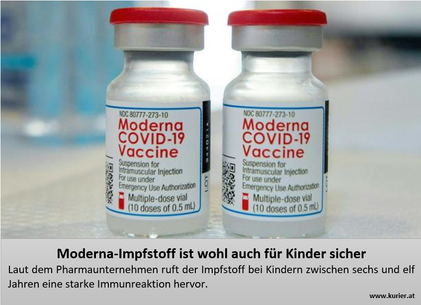

```{r xaringan-themer, include=FALSE, warning=FALSE}
# #This block contains the theme configuration for my slides style
library(xaringanthemer) #
library(showtext)
style_mono_accent(
   # base_color = "#1f5c99",
  text_font_size = "1.5rem",
  header_font_google = google_font("Josefin Sans"),
  text_font_google   = google_font("Arial", "300", "300i"),
  code_font_google   = google_font("Fira Mono")
)
```

```{r setup, include=FALSE}
options(htmltools.dir.version = FALSE)

#potential slide images
# https://pixabay.com/photos/data-computer-internet-online-www-2899901/ Image by <a href="https://pixabay.com/users/geralt-9301/?utm_source=link-attribution&amp;utm_medium=referral&amp;utm_campaign=image&amp;utm_content=2899901">Gerd Altmann</a> from <a href="https://pixabay.com//?utm_source=link-attribution&amp;utm_medium=referral&amp;utm_campaign=image&amp;utm_content=2899901">Pixabay</a>
# https://cdn.pixabay.com/photo/2017/10/29/14/47/data-2899901_960_720.jpg
#   https://pixabay.com/illustrations/corona-coronavirus-ask-5205169/ Image by <a href="https://pixabay.com/users/geralt-9301/?utm_source=link-attribution&amp;utm_medium=referral&amp;utm_campaign=image&amp;utm_content=5205169">Gerd Altmann</a> from <a href="https://pixabay.com//?utm_source=link-attribution&amp;utm_medium=referral&amp;utm_campaign=image&amp;utm_content=5205169">Pixabay</a>
```


layout: true
---
class: left, middle, title-slide
background-image: url("https://cdn.pixabay.com/photo/2017/09/10/18/25/question-2736480_960_720.jpg")
background-size: cover


# Measuring emotions in <br> misinformation studies: 
### Distinguishing emotional state <br> from response & misinformation <br> recognition from susceptibility
### Hannah Metzler
#### Complexity Science Hub Vienna &  <br> Medical University of Vienna 
#### Disinformation Expert Workshop, Zürich, 8-9 Feb 2023 <br> Slides: www.hannahmetzler.eu/measuring_emo_misinfo

---
layout:true
<div class="my-footer"><span>
<a href="https://doi.org/10.1126/science.aao2998">Lazer et al. (2018) </a> 
</span></div>


---

# Misinformation as umbrella term
### False or misleading information

.pull-left[
<br><br>
```{r, echo=FALSE, out.width=500, fig.align='center'}
knitr::include_graphics("figures/fake-news-3801637.svg")
```
]
.pull-right[
* Independent of intent

* Intentional: Disinformation <br>

* False News <br>

* Biased information <br>

* Conspiracies & myths
]

---
layout: true
<div class="my-footer"><span>
<a href="https://doi.org/10.1016/j.tics.2021.02.007"> Pennycook & Rand (2021); </a>
<a href="https://doi.org/10.1186/s41235-020-00252-3"> Martel et al. (2020); </a>
<a href="https://www.pexels.com/photo/annoyed-black-woman-having-video-chat-on-smartphone-at-home-5699823/"> Photo by Alex Green </a> 
</span></div>

---

## Emotions & belief in misinformation - 2 theories

### 1) Emotions make us irrational & open to manipulation

.broad-left[
* Emotions attract attention

  * Trigger actions
  
  * Hinder reflection
  
  * High arousal emotions
  
* Sensational news & emotional manipulation
]

.narrow-right[
```{r, echo=FALSE, out.width=400, fig.align='right'}
knitr::include_graphics("figures/pexels-alex-green-5699823.jpg")
```
]

---
layout: true
<div class="my-footer"><span>
<a href="https://press.princeton.edu/books/hardcover/9780691178707/not-born-yesterday"> Mercier: Not born yesterday (2020); </a>
<a href=""> ; </a>
</span></div>

---

## Emotions & belief in misinformation - 2 theories

### 2) Evolutionary theory of communication: Emotions are adaptive

.broad-left[
* Communication must benefit sender & receiver

* At default, people are skeptical, not gullible

* Function of emotions depends on context:

  * Prior beliefs
  * Source of emotion - timing
  
* Social motives: belonging & reputation

]
.narrow-right[
```{r, echo=FALSE, out.height=300}

```
]

---
layout: true
<div class="my-footer"><span>
<a href="https://journals.sagepub.com/doi/pdf/10.1177/0963721417718261">  Douglas et al. (2017); </a>
<a href="">  Lamberty 3 motives; </a>
<a href="https://press.princeton.edu/books/hardcover/9780691178707/not-born-yesterday"> Mercier: Not born yesterday (2020); </a>
</span></div>

---

## Misinformation in crisis times

.pull-left[
**Uncertainty = susceptibility**

* Anxiety & loss of control

* Sense making to reduce uncertainty

* Simple cause-effect and evil-good stories
  ]

.pull-right[
**Adaptive emotions & behavior**
* Openness to potentially relevant information is adaptive
* Difference between reflective & intuitive beliefs
  
* Reputation motives: 
    * False news: socially relevant
    * Gaining status by cutting bridges
]

???
Cutting bridges by making extreme statements and proving loyalty to a fringe group - statements need to be crazy
Difference between reflective and intuitive beliefs: beliefs that are relevant for our actions

---
layout:true

---

## Methods overview

* Pre-registered replication of correlation study [Martel et al. (2020)](https://doi.org/10.1186/s41235-020-00252-3)

* Online survey, Austria, Dec 2021, N=422, left-leaning & educated sample

* False & real COVID-19 news items: accuracy rating task

<center>
```{r, echo=FALSE, out.height=280}
knitr::include_graphics("figures/N15.PNG")
```
```{r, echo=FALSE, out.height=280}

```
</center>

---

## Replication: Null-results

* Prior to exposure
* Time or reference
* Neglects how a person interprets the information

---

## Immediate emotional response

* 2 figures emotions
* Joy explanation: in the stimulus

---

## Angry responses in people recognizing lies

* curvi-linear

---

## People were angry for different reasons

* word shift graphs

* Confirmed by analysis including prior beliefs/frustration


---

## Take aways: 

* Prior belief determine the meaning of emotion

* How and when we measure emotion in studies matters  

  * Immediate response more plausible than general state
  * Stimulus characteristics: content
  * Forced exposure: low emotions
  
* Social media: 
  * Responses to misinformation posts
  * Prior beliefs/group affiliation necessary
  
### Emotions do not equal gullibility - Emotions are adaptive.
  
  
---


# Thank you! Questions or comments?

.pull-left[.center-left[
 ... and to the project team!
 
```{r, echo=FALSE, out.width=600, fig.align='center'}
knitr::include_graphics("figures/collaborators.svg")
```
]]
.pull-right[
* Project: [hannahmetzler.eu/emomis](hannahmetzler.eu/emomis)

* Staying in touch:
  * metzler@csh.ac.at
  * [hannahmetzler.eu](hannahmetzler.eu)
  * [@hannametzler1](https://twitter.com/hannahmetzler1)
]

... and our funders! <br>
```{r, echo=FALSE, out.width=300}

```
```{r, echo=FALSE, out.width=210}
knitr::include_graphics("figures/csh.png")
```
```{r, echo=FALSE, out.width=260}
knitr::include_graphics("figures/uni_wien_logo_blue.jpg")
```

